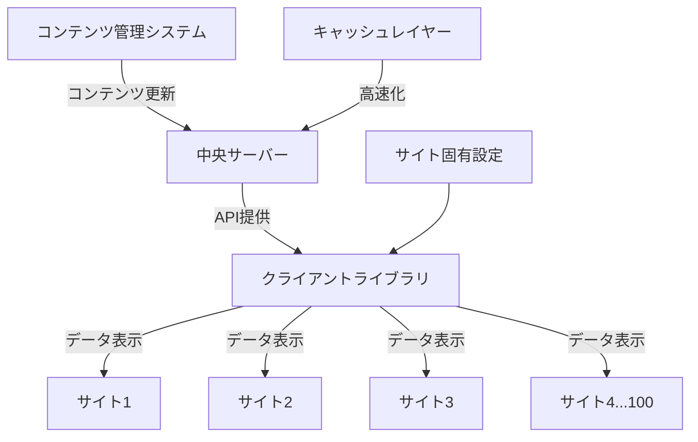

# デザインドキュメント

## 概要

このデザインドキュメントでは、100の類似サイトにコラム表示機能を効率的に展開するための中央集権型システムの設計について詳述します。現在、各サイトは独自にコラム機能を実装しており、共通部分に修正が発生した場合、全サイトを個別に更新する必要があります。本設計では、共通処理を外部サーバーに一元化し、各サイトでの実装を最小限に抑えることで、運用効率を大幅に向上させます。

## アーキテクチャ

システムは以下の主要コンポーネントで構成されます：

### 1. 中央サーバー（Central Server）
- コラム機能の共通ロジックとデータを管理
- RESTful APIを提供し、各サイトからのリクエストに応答
- コンテンツ管理システム（CMS）機能を含む
- キャッシュ機構を実装し、パフォーマンスを最適化

### 2. クライアントライブラリ（Client Library）
- 各サイトに組み込む軽量JavaScriptライブラリ
- 中央サーバーとの通信を処理
- サイト固有の設定を管理
- エラーハンドリングとフォールバック機能を提供

### 3. サイト固有コンポーネント（Site-Specific Components）
- 各サイトのデザインに合わせたテンプレート
- サイト固有の設定ファイル
- 最小限のPHPコード（既存システムとの統合用）

### システムアーキテクチャ図



## コンポーネントとインターフェース

### 1. 中央サーバーAPI

#### 1.1 コラム一覧取得API
- **エンドポイント**: `/api/v1/columns`
- **メソッド**: GET
- **パラメータ**:
  - `site_id`: サイトID（必須）
  - `page`: ページ番号（オプション、デフォルト: 1）
  - `limit`: 1ページあたりの件数（オプション、デフォルト: 10）
  - `sort`: ソート順（オプション、デフォルト: 'post_date_desc'）
- **レスポンス**:
  ```json
  {
    "status": "success",
    "data": {
      "total": 100,
      "page": 1,
      "limit": 10,
      "columns": [
        {
          "id": 1,
          "title": "記事タイトル",
          "seo_keywords": "キーワード1, キーワード2",
          "summary": "記事概要",
          "post_date": "2025-07-08 19:27:00",
          "url": "/column/1/"
        },
        // ...他の記事
      ]
    }
  }
  ```

#### 1.2 コラム詳細取得API
- **エンドポイント**: `/api/v1/columns/{id}`
- **メソッド**: GET
- **パラメータ**:
  - `site_id`: サイトID（必須）
- **レスポンス**:
  ```json
  {
    "status": "success",
    "data": {
      "id": 1,
      "title": "記事タイトル",
      "seo_keywords": "キーワード1, キーワード2",
      "summary": "記事概要",
      "content": "HTMLに変換済みの記事本文",
      "post_date": "2025-07-08 19:27:00",
      "related_columns": [
        {
          "id": 2,
          "title": "関連記事タイトル",
          "url": "/column/2/"
        },
        // ...他の関連記事
      ]
    }
  }
  ```

#### 1.3 最新コラム取得API
- **エンドポイント**: `/api/v1/columns/latest`
- **メソッド**: GET
- **パラメータ**:
  - `site_id`: サイトID（必須）
  - `limit`: 取得件数（オプション、デフォルト: 4）
- **レスポンス**:
  ```json
  {
    "status": "success",
    "data": {
      "columns": [
        {
          "id": 1,
          "title": "記事タイトル",
          "summary": "記事概要",
          "post_date": "2025-07-08 19:27:00",
          "url": "/column/1/"
        },
        // ...他の記事
      ]
    }
  }
  ```

### 2. クライアントライブラリ

#### 2.1 初期化
```javascript
ColumnCentralizer.init({
  siteId: 'site1',
  apiEndpoint: 'https://uranai.flier.jp/uranai_common/api/v1',
  templates: {
    list: 'column_list_template',
    detail: 'column_detail_template',
    latest: 'column_latest_template'
  },
  errorTemplate: 'column_error_template',
  cacheExpiry: 3600, // キャッシュ有効期間（秒）
  fallbackData: {...} // オプションのフォールバックデータ
});
```

#### 2.2 コラム一覧表示
```javascript
ColumnCentralizer.renderList({
  container: '#column_list_container',
  page: 1,
  limit: 10,
  onSuccess: function(data) { /* 成功時のコールバック */ },
  onError: function(error) { /* エラー時のコールバック */ }
});
```

#### 2.3 コラム詳細表示
```javascript
ColumnCentralizer.renderDetail({
  container: '#column_detail_container',
  columnId: 1,
  onSuccess: function(data) { /* 成功時のコールバック */ },
  onError: function(error) { /* エラー時のコールバック */ }
});
```

#### 2.4 最新コラム表示
```javascript
ColumnCentralizer.renderLatest({
  container: '#column_latest_container',
  limit: 4,
  onSuccess: function(data) { /* 成功時のコールバック */ },
  onError: function(error) { /* エラー時のコールバック */ }
});
```

### 3. サイト固有コンポーネント

#### 3.1 設定ファイル
各サイトには以下の設定ファイルを配置します：

```php
// column_config.php
return [
  'site_id' => 'site1',
  'api_endpoint' => 'https://uranai.flier.jp/uranai_common/api/v1',
  'cache_expiry' => 3600,
  'templates' => [
    'list' => 'column_list.html',
    'detail' => 'column_detail.html',
    'latest' => 'column_latest.html',
    'error' => 'column_error.html'
  ],
  'url_format' => [
    'list' => '/column/',
    'detail' => '/column/{id}/'
  ],
  'custom_css_class' => 'site1-column',
  'items_per_page' => 10
];
```

#### 3.2 テンプレート
各サイトは以下のテンプレートを独自にカスタマイズできます：

- `column_list.html`: コラム一覧ページのテンプレート
- `column_detail.html`: コラム詳細ページのテンプレート
- `column_latest.html`: トップページでの最新コラム表示用テンプレート
- `column_error.html`: エラー表示用テンプレート

## データモデル

### 1. コラム記事モデル

```json
{
  "id": "integer",
  "title": "string",
  "seo_keywords": "string",
  "summary": "string",
  "content": "string",
  "content_markdown": "string",
  "post_date": "datetime",
  "created_date": "datetime",
  "updated_date": "datetime",
  "status": "string", // 'published', 'draft', 'scheduled'
  "site_visibility": ["site_id1", "site_id2", ...],
  "author": "string",
  "thumbnail_url": "string",
  "tags": ["tag1", "tag2", ...],
  "category": "string"
}
```

### 2. サイト設定モデル

```json
{
  "site_id": "string",
  "site_name": "string",
  "domain": "string",
  "api_key": "string",
  "allowed_features": ["list", "detail", "latest", ...],
  "max_items_per_page": "integer",
  "custom_settings": {
    "key1": "value1",
    "key2": "value2",
    ...
  },
  "created_date": "datetime",
  "updated_date": "datetime",
  "status": "string" // 'active', 'inactive'
}
```

## エラーハンドリング

### 1. APIエラーハンドリング

APIは以下の形式でエラーを返します：

```json
{
  "status": "error",
  "error": {
    "code": "ERROR_CODE",
    "message": "エラーメッセージ"
  }
}
```

主なエラーコード：
- `INVALID_SITE_ID`: 無効なサイトID
- `COLUMN_NOT_FOUND`: 指定されたコラムが見つからない
- `UNAUTHORIZED`: 認証エラー
- `RATE_LIMIT_EXCEEDED`: APIリクエスト制限超過
- `SERVER_ERROR`: サーバー内部エラー

### 2. クライアントサイドエラーハンドリング

クライアントライブラリは以下のエラーハンドリング機能を提供します：

1. **自動リトライ**: 一時的なネットワークエラーの場合、設定された回数だけ自動的にリトライ
2. **キャッシュフォールバック**: サーバーに接続できない場合、ローカルキャッシュからデータを表示
3. **デフォルトコンテンツ**: キャッシュも利用できない場合、事前設定されたデフォルトコンテンツを表示
4. **エラーログ**: 発生したエラーを中央サーバーに送信し、問題の早期発見と解決を支援

## テスト戦略

### 1. ユニットテスト
- 中央サーバーAPIの各エンドポイントのテスト
- クライアントライブラリの各機能のテスト
- データモデルのバリデーションテスト

### 2. 統合テスト
- クライアントライブラリと中央サーバー間の通信テスト
- キャッシュ機構の動作テスト
- エラーハンドリングとフォールバック機能のテスト

### 3. パフォーマンステスト
- 高負荷時のAPIレスポンス時間測定
- 複数サイトからの同時アクセス時の挙動テスト
- キャッシュ効率の測定

### 4. セキュリティテスト
- APIキー認証の検証
- クロスサイトスクリプティング（XSS）対策の検証
- クロスサイトリクエストフォージェリ（CSRF）対策の検証

### 5. 互換性テスト
- 異なるブラウザでの動作確認
- モバイルデバイスでの表示確認
- 異なるPHPバージョンでの動作確認

## セキュリティ対策

### 1. API認証
- 各サイトには固有のAPIキーを発行
- リクエスト時にAPIキーとサイトIDの組み合わせを検証
- HTTPS通信の強制

### 2. データ保護
- センシティブなデータの暗号化
- 不要なデータの公開を防ぐためのレスポンスフィルタリング
- データベースへのアクセス制限

### 3. リクエスト制限
- サイトごとのAPIリクエスト制限の実装
- 異常なアクセスパターンの検出と遮断
- DDos攻撃対策の実装

### 4. コンテンツセキュリティ
- ユーザー入力データのサニタイズ
- HTMLコンテンツのXSS対策
- iframeやスクリプトの制限

## パフォーマンス最適化

### 1. キャッシュ戦略
- **サーバーサイドキャッシュ**: 頻繁にアクセスされるデータをメモリキャッシュに保存
- **CDN活用**: 静的リソース（JS、CSS）をCDNで配信
- **クライアントサイドキャッシュ**: ブラウザのローカルストレージを活用

### 2. データ最適化
- レスポンスデータの最小化（必要な情報のみ返す）
- 画像の最適化（サイズ、形式）
- ページネーションによるデータ分割

### 3. 負荷分散
- 複数サーバーへのロードバランシング
- データベースの読み書き分離
- バックグラウンド処理の非同期化

### 4. モニタリングと自動スケーリング
- リアルタイムのパフォーマンスモニタリング
- 負荷に応じた自動スケーリング
- ボトルネックの早期発見と対応

## デプロイメント戦略

### 1. 段階的デプロイメント
1. **開発環境**: 機能開発とユニットテスト
2. **ステージング環境**: 統合テストとパフォーマンステスト
3. **本番環境**: 段階的なロールアウト（最初は数サイトのみ）

### 2. サイト導入プロセス
1. サイト管理者向けの設定ガイドの作成
2. 必要なファイル（JS、設定ファイル、テンプレート）の提供
3. 導入サポートとトラブルシューティング

### 3. バージョン管理
- セマンティックバージョニングの採用
- 下位互換性の維持
- 変更履歴の詳細な記録

### 4. ロールバック計画
- 問題発生時の迅速なロールバック手順
- バージョン間の切り替え機能
- データバックアップと復元プロセス

## 将来の拡張計画

### 1. 機能拡張
- カテゴリ別表示機能
- タグ検索機能
- コメント機能
- いいね/シェア機能

### 2. 管理機能強化
- コンテンツ管理ダッシュボードの改善
- 詳細なアクセス統計
- A/Bテスト機能

### 3. インテグレーション
- SNS連携機能
- メールマガジン連携
- 他のCMSとの統合

### 4. AI活用
- 関連記事の自動推薦
- コンテンツの自動タグ付け
- ユーザー行動に基づくパーソナライゼーション